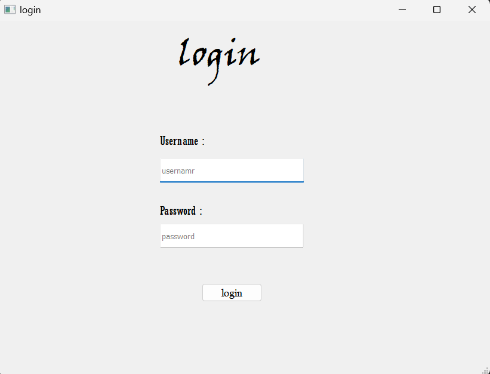
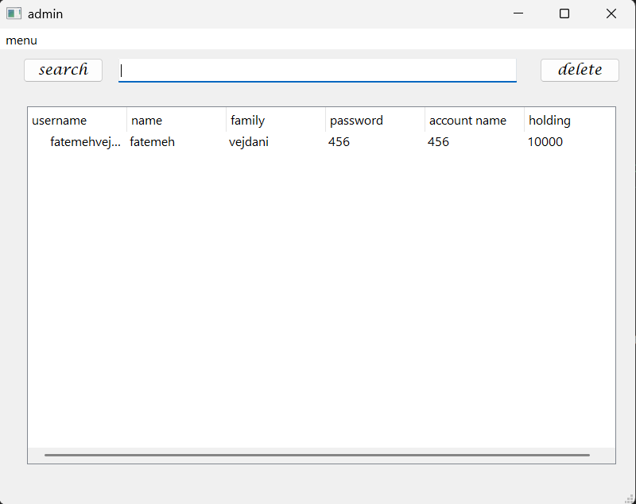
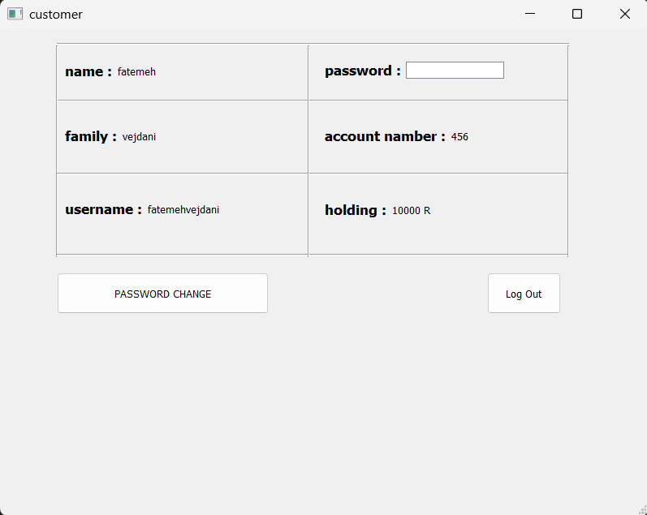

# MyFirstBankSys

A beginner-level desktop banking management system built with Python and PyQt5.  
This project was developed as a university assignment during my first month of learning Python — without any help from AI tools like ChatGPT — just through YouTube tutorials and independent research.

**Completed:** Fall 1401, Term 1 — Computer Engineering

---

## 📌 Overview

**MyFirstBankSys** is a simple desktop application intended to simulate a basic banking system interface.  
It features two user roles: **Admin** and **Customer**.

🔐 **Admin Login:**  
- **Username:** `admin`  
- **Password:** `123`

👤 **Customer Login:**  
- **Username:** `fatemehvejdani`  
- **Password:** `456`

---

## 🧠 Features

### Admin Panel:
- View all customers' data
- Add new customer (incomplete)
- Search for customer (UI present, functionality incomplete)

### Customer Panel:
- View personal account data
- Change password

> ⚠️ Many features are partially implemented or UI-only. Some functionalities are not working due to lack of time.

---

## 🛠️ Tech Stack

- **Language:** Python 3
- **GUI:** PyQt5 & Qt Designer
- **No database** used (UI-based simulation)

---

## 🚀 Getting Started

1. Clone the repository:  
   `git clone https://github.com/FatemehVejdani/university-projects.git`

2. Navigate to the project folder:  
   `cd university-projects/MyFirstBankSys`

3. Install dependencies:  
   `pip install -r requirements.txt`

4. Run the application:  
   `python main.py`

---

## 📷 Screenshots

  
  
  

